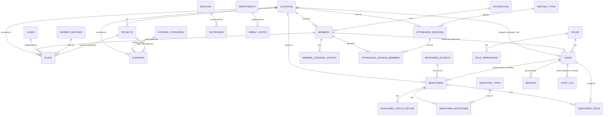

# DCLM Bahrain CMS: Consolidated Data Dictionary
## Batch 0.7: Full schema, all modules, final review before Phase 1

This document merges Batches 0.1 through 0.6 into one reference. Every decision here was already reviewed and approved individually , this batch's job is to check the six pieces fit together as one consistent whole, and to give a full picture of the system before any Django code is written. The six individual batch documents remain available as the detailed record of *why* each decision was made.

---

## 1. Full table list, by module

| Module | Tables |
|---|---|
| Core / shared | `locations` |
| Members & Households | `households`, `members`, `member_category_history` |
| Attendance & Meetings | `meeting_types`, `attendance_sessions`, `attendance_session_members` |
| Newcomers & Follow-up | `newcomer_sources`, `newcomers`, `newcomer_status_history`, `milestone_types`, `newcomer_milestones`, `newcomer_tasks`, `follow_up_urgency_settings` |
| Giving, Expenses & Projects | `funds`, `payment_methods`, `expense_categories`, `giving`, `expenses`, `projects` |
| Goals & Reports | `goals`, `services`, `departments`, `testimonies`, `weekly_notes`, `reports` |
| Users, Roles & Audit | `users`, `roles`, `role_permissions`, `audit_log` |

26 tables total.

---

## 2. Entity-relationship diagram

**Not shown on the diagram, and deliberately so:** `goals`. Auto-tracked goals don't hold a foreign key to any single row , they compute their value live by querying Attendance, Members, Newcomers, and Testimonies data at read-time (e.g. "count all Salvation milestones this month"). This is a read-time aggregation, not a stored relationship, so it's noted here in text rather than drawn as a line.

---

## 3. Full field reference

### Core / shared

**`locations`**
| Field | Type | Notes |
|---|---|---|
| id | Text/Slug (PK) | |
| name | Text | |
| note | Text | Optional context, e.g. "Qatar" for the demo's "Others" entry |
| is_core | Boolean | True only for Bahrain , prevents deletion. Every other location is fully Admin-manageable. |

### Members & Households

**`households`**: id (PK), name, address, phone.

**`members`**: id (PK), surname*, first_name*, other_names, gender, date_of_birth (must not be future/implausibly old), phone (unique, international format), email (not unique, validated format), category* (General Member / Worker in Training / Worker), location_id* (FK), joined_date*, household_id (FK, nullable).
*required

**`member_category_history`**: id (PK), member_id (FK), from_category, to_category, changed_date. Corrections allowed by Admin or the relevant Location Coordinator directly , not append-only, no separate escalation step.

### Attendance & Meetings

**`meeting_types`**: id (PK), name, day, frequency (weekly/occasional , display only), detail_level (detailed/simple , controls which headcount categories apply), monthly_target (nullable, applies regardless of frequency).

**`attendance_sessions`**: id (PK), meeting_type_id (FK), date, location_id (FK), mode (in-person/online), status (pending/filled), track_named (boolean), plus one headcount column per category (men, women, youth_boys, youth_girls, children_boys, children_girls , nullable per meeting's detail level). Headcount is always the source of truth for totals.

**`attendance_session_members`**: session_id (FK), member_id (FK). No location restriction , any member can be checked into any session.

**Process rule (not a table):** recurring weekly sessions are generated fully automatically by a scheduled backend job , no manual "New Session" click needed for the fixed weekly schedule.

### Newcomers & Follow-up

**`newcomer_sources`**: id (PK), name. Admin-configurable list.

**`newcomers`**: id (PK), name, source_id (FK), stage (new/contacted/visiting/integrated/not-interested), assigned_to (FK → users, nullable = "Unassigned"), location_id (FK), created_at, stage_since, not_interested_note.

**`newcomer_status_history`**: id (PK), newcomer_id (FK), stage, note, date. New table , preserves a Not Interested → Reactivated episode visibly on the person's own profile, not just in the general Audit Log.

**`milestone_types`**: id (PK), name. Admin-configurable list (seeded: Salvation, Water Baptism, Holy Ghost Baptism, Sanctification).

**`newcomer_milestones`**: newcomer_id (FK), milestone_type_id (FK), achieved_date (nullable).

**`newcomer_tasks`**: id (PK), newcomer_id (FK), text, due_date, done, assigned_to (FK → users, nullable , defaults to the newcomer's primary leader, but can be reassigned individually).

**`follow_up_urgency_settings`**: id (PK), stage, amber_days, red_days. Admin-adjustable (seeded: New 3/6, Contacted 5/10, Visiting 15/30).

### Giving, Expenses & Projects

**`funds`**, **`payment_methods`**, **`expense_categories`**: each just (id, name) , admin-configurable lists, same pattern throughout.

**`giving`**: id (PK), date, fund_id (FK), method_id (FK), amount (Decimal), location_id (FK), project_id (FK, nullable), member_id (FK → members, nullable).

**`expenses`**: id (PK), date, category_id (FK), amount (Decimal), location_id (FK), description, receipt_file_url (real uploaded file, Azure Blob , not inline data), project_id (FK, nullable).

**`projects`**: id (PK), name, description, location_id (FK), target_amount (Decimal), target_date (nullable), status (Active/Completed/Archived).

### Goals & Reports

**`goals`**: id (PK), horizon, name, target, current (used only when tracking = manual), unit, tracking (auto/manual), period_type (month/quarter/year/none , auto goals filter their underlying query to this window), source (plain-language description), link_route, link_tab.

**`services`**, **`departments`**: each (id, name) , admin-configurable lists.

**`testimonies`**: id (PK), member_name (nullable if anonymous), is_anonymous, date, service_id (FK), text.

**`weekly_notes`**: id (PK), department_id (FK), week_label, week_start, highlights, challenges, prayer_points.

**`reports`**: id (PK), period_month, period_year, generated_by (FK → users), generated_at, other_additions, pdf_file_url. Real stored history , past reports are browsable, not one-time exports.

### Users, Roles & Audit

**`users`**: id (PK), name, email (unique , real login identifier), password_hash, role_id (FK), location_id (FK, nullable = all locations), member_id (FK → members, nullable), status (Active/Inactive), last_login.

**`roles`**: id (PK), name.

**`role_permissions`**: role_id (FK), module, can_view, can_create, can_edit, can_delete , real action-level permissions, not just page visibility.

**`audit_log`**: id (PK), user_id (FK, nullable on delete), user_name_snapshot (preserves readability even if the account is later renamed/removed), timestamp, action, entity_type, entity_name, details.

---

## 4. Cross-cutting rules that apply everywhere, not just one module

These came up repeatedly across the six batches and apply system-wide:

1. **Server-side enforcement is mandatory.** Every role and location restriction must be independently checked on the backend for every request. Nothing about the frontend hiding a button is ever the real security boundary.
2. **Money is always Decimal, never float.** Applies to `giving.amount`, `expenses.amount`, `projects.target_amount`.
3. **Files are real uploads with a stored URL reference (Azure Blob), never inline data.** Applies to receipts and generated report PDFs.
4. **"Configurable list" is a repeated pattern**, not a one-off: Funds, Payment Methods, Expense Categories, Newcomer Sources, Milestone Types, Services, Departments all work the same way , Admin can add/remove entries without a developer, and every one of them replaced something that started as free text or a hardcoded option in the demo.
5. **Computed values over stored running totals**, wherever practical: a project's amount raised, an auto-tracked goal's current value, and a member's display name are all calculated live from source data rather than a separately stored number that could drift out of sync.

---

## 5. Consistency check: no issues found

Went through all six batches specifically looking for naming conflicts, mismatched relationships, or a decision in one batch that contradicts another. Everything lines up: `location_id` is used the same way in every module that references it, `users.id` is referenced consistently by the three modules that needed it (Newcomers assignment, Reports authorship, Audit Log) even though Users wasn't formally defined until Batch 0.6, and the "configurable list" pattern was applied the same way every time it came up.

**Phase 0 is complete.** Ready to begin Phase 1 (Django backend foundation) on your confirmation.
